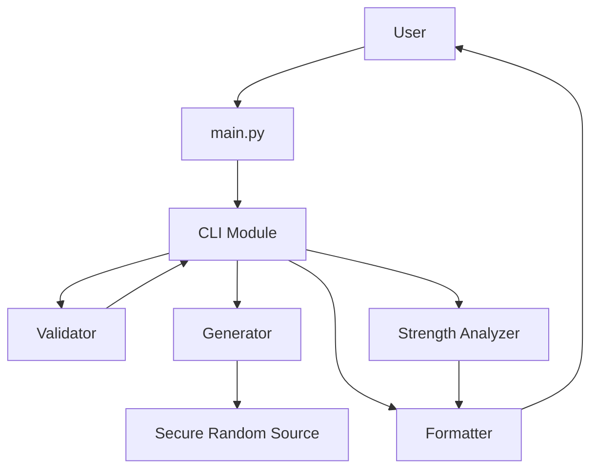
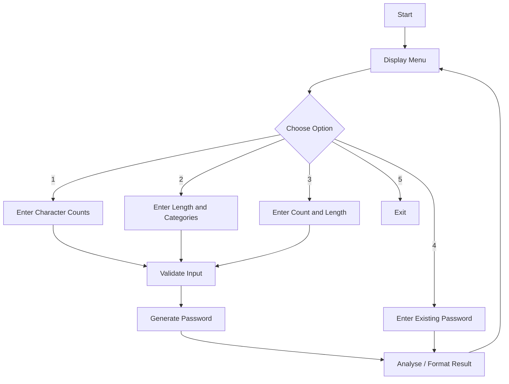

# 🔐 Python Password Generator

**VITyarthi — Python Essentials Project**

**Student:** Adarsh Kumar  
**Registration No.:** 26BAI10716  
**Professor:** Vaishnavi S  
**College:** VIT, Bhopal

## 1. Overview

This project is a command-line password generation and analysis application built using Python. It evolved from a basic password generator into a modular project with separate components for input validation, secure generation, password-strength analysis, formatting, and CLI interaction.

The project is designed to demonstrate Python Essentials concepts in a practical problem.

## 2. Main Features

1. **Character-count password generation** — specify lowercase, uppercase, symbol, and number counts.
2. **Length-based generation** — choose a total password length and character categories.
3. **Batch generation** — generate multiple passwords in one run.
4. **Password analysis** — inspect length, character categories, and approximate entropy.
5. **Input validation** — invalid numeric input is handled without crashing the program.
6. **Secure random selection** — uses Python's `secrets` module for character selection.

## 3. Project Structure

```text
password-generator-vityarthi/
├── main.py
├── requirements.txt
├── README.md
├── statement.md
├── PROJECT_REPORT.md
├── LICENSE
├── .gitignore
├── src/
│   ├── config.py
│   ├── validator.py
│   ├── generator.py
│   ├── strength.py
│   ├── formatter.py
│   ├── utils.py
│   └── cli.py
├── tests/
│   └── test_project.py
└── docs/
    └── diagrams.md
```

## 4. Technologies Used

- Python 3.9+
- Python Standard Library
- Git and GitHub
- Command-line interface

No external Python packages are required.

## 5. Installation

### Prerequisites

Install Python 3.9 or newer.

Verify:

```bash
python --version
```

### Clone the repository

```bash
git clone https://github.com/YOUR-USERNAME/password-generator-vityarthi.git
cd password-generator-vityarthi
```

Replace `YOUR-USERNAME` with the GitHub username used for submission.

### Dependencies

There are no third-party dependencies.

```bash
python -m pip install -r requirements.txt
```

## 6. Run the Project

From the repository root:

```bash
python main.py
```

The project is fully command-line executable.

## 7. Menu

```text
==========================================================
           PYTHON PASSWORD GENERATOR
==========================================================
Secure CLI project for generating and analysing passwords.

Options:
  1. Generate a password by character counts
  2. Generate a password by total length
  3. Generate multiple passwords
  4. Analyse an existing password
  5. Exit
```

## 8. Testing

Run:

```bash
python tests/test_project.py
```

Expected result:

```text
All tests passed.
```

The tests cover input validation, character-count generation, length-based generation, batch generation, and strength analysis.

## 9. Design

### Architecture



### Workflow



## 10. Security Note

The project uses `secrets.choice()` rather than the ordinary `random` module for password character selection. This is appropriate for a security-oriented educational project. No generated password is saved to a database or transmitted to an external service.

The strength calculation is an educational estimate, not a replacement for a professional password-auditing service.

## 11. Future Enhancements

- GUI using Tkinter.
- Clipboard integration.
- Configurable custom character sets.
- Password history with explicit user-controlled local storage.
- More advanced password-strength analysis.
- Packaging as an installable command-line application.

## 12. Academic Submission

This repository contains the source code, documentation, testing code, project statement, and report content required for the VITyarthi project format. The detailed PDF report is prepared separately for portal submission.

## 13. Author

**Adarsh Kumar**  
Registration No. **26BAI10716**  
VIT, Bhopal
