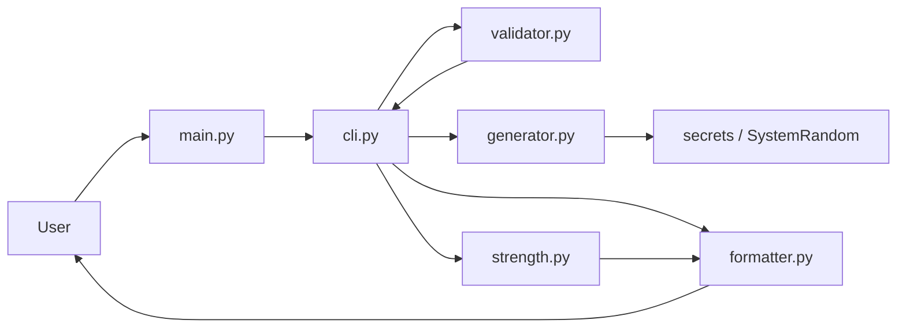
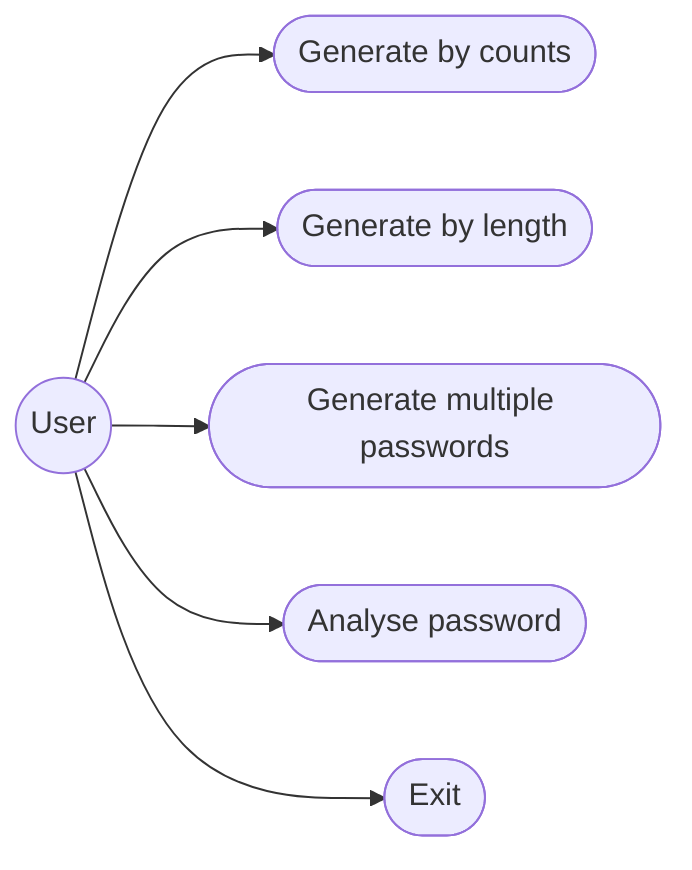
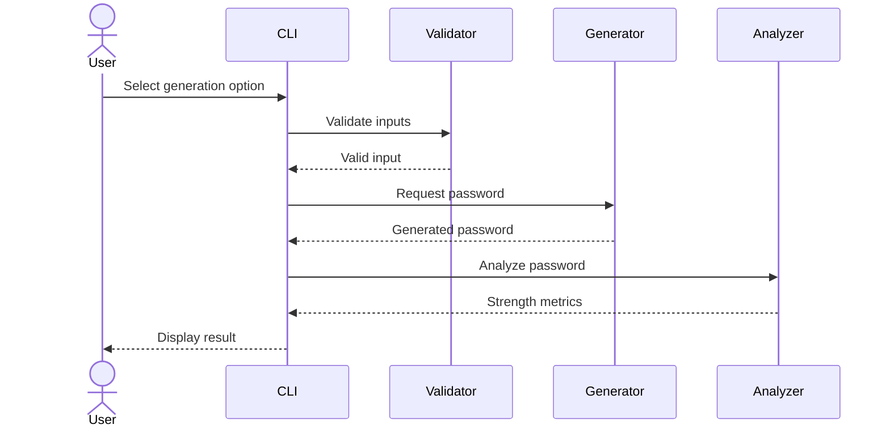
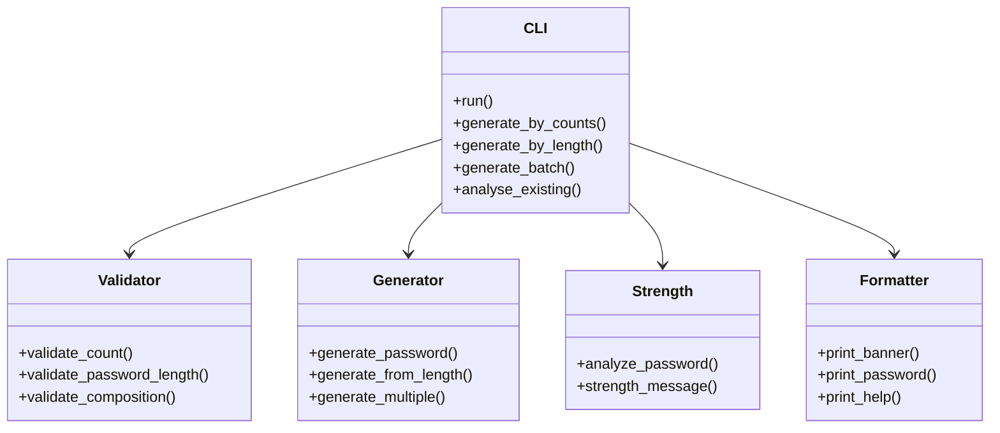

# Design Diagrams

## System Architecture

## Use Case Diagram

## Sequence Diagram

## Component / Class View

No ER diagram is required because this version does not use persistent database storage.
